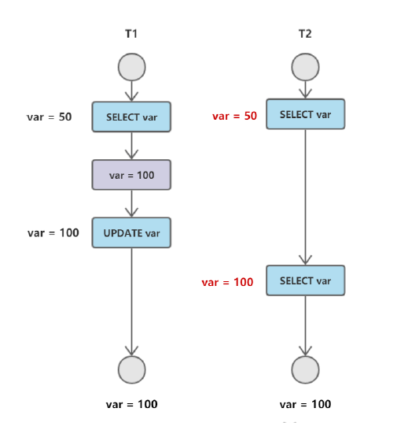

# MySQL数据库

## 事务

事务指的是满足 ACID 特性的一组操作，可以通过 Commit 提交一个事务，也可以使用 Rollback 进行回滚。

### ACID是什么？

1. 原子性（Atomicity）
事务被视为不可分割的最小单元，事务的所有操作要么全部提交成功，要么全部失败回滚。回滚可以用回滚日志来实现，回滚日志记录着事务所执行的修改操作，在回滚时反向执行这些修改操作即可。
2. 一致性（Consistency）
数据库在事务执行前后都保持一致性状态。在一致性状态下，所有事务对一个数据的读取结果都是相同的。
3. 隔离性（Isolation）
一个事务所做的修改在最终提交以前，对其它事务是不可见的。
4. 持久性（Durability）
一旦事务提交，则其所做的修改将会永远保存到数据库中。即使系统发生崩溃，事务执行的结果也不能丢失。使用重做日志来保证持久性。

---

事务的 ACID 特性概念简单，但不是很好理解，主要是因为这几个特性不是一种平级关系：

- 只有满足一致性，事务的执行结果才是正确的。

- 在无并发的情况下，事务串行执行，隔离性一定能够满足。此时只要能满足原子性，就一定能满足一致性。

- 在并发的情况下，多个事务并行执行，事务不仅要满足原子性，还需要满足隔离性，才能满足一致性。

- 事务满足持久化是为了能应对数据库崩溃的情况。

  

### 并发一致性问题

在并发环境下，如果不保证隔离性的话，会出现很多并发一致性问题。

1. 丢失修改

T1 和 T2 两个事务都对一个数据进行修改，T1 先修改，T2 随后修改，T2 的修改覆盖了 T1 的修改。

2. 脏读

   T1 修改一个数据，T2 随后读取这个数据。如果 T1 撤销了这次修改，那么 T2 读取的数据是脏数据。

3. 不可重复读

T2 读取一个数据，T1 对该数据做了修改。如果 T2 再次读取这个数据，此时读取的结果和第一次读取的结果不同。

4. 幻读

   T1 读取某个范围的数据，T2 在这个范围内插入新的数据，T1 再次读取这个范围的数据，此时读取的结果和和第一次读取的结果不同。

   

   ---

   产生并发不一致性问题主要原因是破坏了事务的隔离性，解决方法是通过并发控制来保证隔离性。并发控制可以通过封锁来实现，但是封锁操作需要用户自己控制，相当复杂。数据库管理系统提供了事务的隔离级别，让用户以一种更轻松的方式处理并发一致性问题。

### 事务的隔离级别

1. 未提交读（READ UNCOMMITTED）

   事务中的修改，即使没有提交，对其他事务也是可见的。

2. 提交读（READ COMMITTED）

   一个事务只能读取已经提交的事务所做的修改。换句话说，一个事务所做的修改在提交之前对其它事务是不可见的。

3. 可重复读（REPEATABLE READ）

   保证在同一个事务中多次读取同样数据的结果是一样的。

4. 可串行化（SERIALIZABLE）

   强制事务串行执行，需要加锁实现，而其他隔离级别不需要。

### 多版本并发控制（MVCC）

多版本并发控制（Multi-Version Concurrency Control, MVCC）是 MySQL 的 InnoDB 存储引擎实现隔离级别的一种具体方式，用于实现提交读和可重复读这两种隔离级别。而未提交读隔离级别总是读取最新的数据行，无需使用MVCC。可串行化隔离级别需要对所有读取的行都加锁，单纯使用 MVCC 无法实现。

**版本号**

- 系统版本号：是一个递增的数字，每开始一个新的事务，系统版本号就会自动递增。
- 事务版本号：事务开始时的系统版本号。

**隐藏的列**

MVCC在每行记录后面都保存着两个隐藏的列，用来存储两个版本号。

- 创建版本号：指示创建一个数据行的快照时的系统版本号；
- 删除版本号：如果该快照的删除版本号大于当前事务版本号表示该快照有效，否则表示该快照已经被删除了。

**Undo日志**

MVCC使用到的快照存储在Undo日志中，该日志通过回滚指针把一个数据行（Record）的所有快照连接起来。

#### 实现过程

