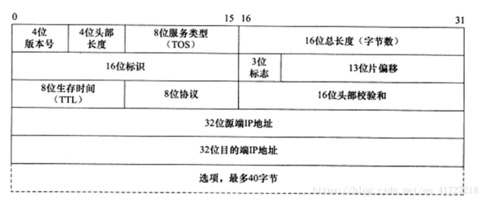

# 网络层

## IP结构

- 4位版本号指定IP协议的版本。对于IPv4来说，其值是4.其他IPv4的扩展版本（如SIP协议和PIP协议），则具有不同的版本号。
- 4位头部长度标识该IP头部有多少个32bit字（4字节）。因为4位最大能表示15，所以IP头部最长是60字节。
- 8位服务类型包括一个3位的优先权字段，4位的TOS字段和1位的保留字段（必须置0）。4位的TOS字段分别表示：最小延时，最大吞吐量，最高可靠性和最小费用。其中最多有一个能置位1，应用程序应该根据实际需要来设置它。比如像ssh和telnet这样的登陆程序需要的是最小延时服务，而文件传输程序ftp则需要最大吞吐量的服务。
- 16位总长度是指整个IP数据报的长度，以字节为单位，因此IP数据报的最大长度为65535字节。但由于MTU的限制，长度超过MTU的数据报都将被分片传输，所以实际传输的IP数据报的长度都远远没有达到最大值。
- 16位标识唯一地标识主机发送地每一个数据报。其初始值由系统随机生成，每发送一个数据报，其值就加1.该值在数据报分片时被复制到每个分片中，因此同一个数据报地所有分片都具有相同地标识。
- 3位标志字段地第一位保留。第二位表示"禁止分片"。如果设置了这个位，IP模块将不对数据报进行分片。在这种情况下，如果IP数据报长度超过MTU的话，IP模块将丢弃该数据报并返回一个ICMP差错报文。第三位表示“更多分片”。除了数据报的最后一个分片外，其他分片都要把它置1。
- 13位分片偏移是分片相对原始IP数据报开始处(仅指数据部分)的偏移。实际的偏移值是该值左移3位（乘8）后得到的。由于这个原因，除了最后一个IP分片外，每个IP分片的数据部分的长度必须是8的整数倍(这样才能保证后面的IP分片拥有一个合适的偏移量)。
- 8位生存时间(TTL)是数据报到达目的地之前允许经过的路由器跳数。TTL值被发送端设置(常见值位64)。数据报在转发过程中每经过一个路由，该值就被路由器减1。当TTL值减为0时，路由器将丢弃数据报，并向源端发送一个ICMP差错报文。TTL值可以防止数据报陷入路由循环。
- 8位协议用来区分上层协议，/etc/protocols文件定义了所有上层协议对应的protocol字段的数值。其中ICMP是1，TCP是6，UDP是17。
- 16位头部校验和由发送端填充，接收端对其使用CRC算法以检验IP数据报头部在传输过程中是否损坏。
- 32位的源端IP地址和目的端IP地址用来标识数据报的发送端和接收端。一般情况下，这两个地址在整个数据报的传递过程中保持不变，而不论它中间经过多少个中转路由器。
- IPv4最后一个选项字段是可变长的可选信息。这部分最多包含40个字节，因为IP头部最长是60字节（其中还包含前面讨论的20字节的固定部分）。可用的IP选项包括：
  1. 记录路由，告诉数据报途径的所有路由器都将自己的IP地址填入IP头部的选项部分，这样就可以跟踪数据报的传递路径。
  2. 时间戳，告诉每个路由器都将数据报被转发的时间填入IP头部的选项部分，这样就可以测量途径路由之间数据报传输时间。
  3. 松散源路由选择，指定一个路由器IP地址列表，数据报发送过程必须经过其中所有的路由器。
  4. 严格源路由选择，和松散源路由选择类似，不过数据报只能经过被指定的路由器。

## IP协议的定义和作用

IP 协议（Internet Protocol）又称互联网协议，是支持网间互联的数据包协议。该协议工作在网络层，主要目的就是为了提高网络的可扩展性，和传输层 TCP 相比，IP 协议提供一种无连接/不可靠、尽力而为的数据包传输服务，其与TCP协议（传输控制协议）一起构成了TCP/IP 协议族的核心。IP 协议主要有以下几个作用：

- 寻址和路由：在IP 数据包中会携带源 IP 地址和目的 IP 地址来标识该数据包的源主机和目的主机。IP 数据报在传输过程中，每个中间节点（IP 网关、路由器）只根据网络地址进行转发，如果中间节点是路由器，则路由器会根据路由表选择合适的路径。IP 协议根据路由选择协议提供的路由信息对 IP 数据报进行转发，直至抵达目的主机。
- 分段与重组：IP 数据包在传输过程中可能会经过不同的网络，在不同的网络中数据包的最大长度限制是不同的，IP 协议通过给每个 IP 数据包分配一个标识符以及分段与组装的相关信息，使得数据包在不同的网络中能够传输，被分段后的 IP 数据报可以独立地在网络中进行转发，在到达目的主机后由目的主机完成重组工作，恢复出原来的 IP 数据包。

## IPV4 地址不够如何解决

- DHCP：动态主机配置协议。动态分配 IP 地址，只给接入网络的设备分配IP地址，因此同一个 MAC 地址的设备，每次接入互联网时，得到的IP地址不一定是相同的，该协议使得空闲的 IP 地址可以得到充分利用。
- CIDR：无类别域间路由。CIDR 消除了传统的 A 类、B 类、C 类地址以及划分子网的概念，因而更加有效的分配 IPv4 的地址空间，但无法从根本上解决地址耗尽问题。
- NAT：网络地址转换协议。我们知道属于不同局域网的主机可以使用相同的 IP 地址，从而一定程度上缓解了 IP 资源枯竭的问题。然而主机在局域网中使用的 IP 地址是不能在公网中使用的，当局域网主机想要与公网进行通信时， NAT 方法可以将该主机 IP 地址转换成全球 IP 地址。该协议能够有效解决 IP 地址不足的问题。
- IPv6 ：作为接替 IPv4 的下一代互联网协议，其可以实现 2 的 128 次方个地址，而这个数量级，即使是给地球上每一颗沙子都分配一个IP地址，该协议能够从根本上解决 IPv4 地址不够用的问题。

## 路由器的分组转发流程

① 从 IP 数据包中提取出目的主机的 IP 地址，找到其所在的网络；

② 判断目的 IP 地址所在的网络是否与本路由器直接相连，如果是，则不需要经过其它路由器直接交付，否则执行 ③；

③ 检查路由表中是否有目的 IP 地址的特定主机路由。如果有，则按照路由表传送到下一跳路由器中，否则执行 ④；

④ 逐条检查路由表，若找到匹配路由，则按照路由表转发到下一跳路由器中，否则执行步骤 ⑤；

⑤ 若路由表中设置有默认路由，则按照默认路由转发到默认路由器中，否则执行步骤 ⑥；

⑥ 无法找到合适路由，向源主机报错。

## ICMP 协议概念/作用

ICMP（Internet Control Message Protocol）是因特网控制报文协议，主要是实现 IP 协议中未实现的部分功能，是一种网络层协议。该协议并不传输数据，只传输控制信息来辅助网络层通信。其主要的功能是验证网络是否畅通（确认接收方是否成功接收到 IP 数据包）以及辅助 IP 协议实现可靠传输（若发生 IP 丢包，ICMP 会通知发送方 IP 数据包被丢弃的原因，之后发送方会进行相应的处理）。

- Ping

Ping（Packet Internet Groper），即因特网包探测器，是一种工作在网络层的服务命令，主要用于测试网络连接量。本地主机通过向目的主机发送 ICMP Echo 请求报文，目的主机收到之后会发送 Echo 响应报文，Ping 会根据时间和成功响应的次数估算出数据包往返时间以及丢包率从而推断网络是否通常、运行是否正常等。

- TraceRoute

TraceRoute 是 ICMP 的另一个应用，其主要用来跟踪一个分组从源点耗费最少 TTL 到达目的地的路径。TraceRoute 通过逐渐增大 TTL 值并重复发送数据报来实现其功能，首先，TraceRoute 会发送一个 TTL 为 1 的 IP 数据报到目的地，当路径上的第一个路由器收到这个数据报时，它将 TTL 的值减 1，此时 TTL = 0，所以路由器会将这个数据报丢掉，并返回一个差错报告报文，之后源主机会接着发送一个 TTL 为 2 的数据报，并重复此过程，直到数据报能够刚好到达目的主机。此时 TTL = 0，因此目的主机要向源主机发送 ICMP 终点不可达差错报告报文，之后源主机便知道了到达目的主机所经过的路由器 IP 地址以及到达每个路由器的往返时间。

## ARP 地址解析协议的原理和地址解析过程

ARP（Address Resolution Protocol）是地址解析协议的缩写，该协议提供根据 IP 地址获取物理地址的功能，它工作在第二层，是一个数据链路层协议，其在本层和物理层进行联系，同时向上层提供服务。当通过以太网发送 IP 数据包时，需要先封装 32 位的 IP 地址和 48位 MAC 地址。在局域网中两台主机进行通信时需要依靠各自的物理地址进行标识，但由于发送方只知道目标 IP 地址，不知道其 MAC 地址，因此需要使用地址解析协议。 ARP 协议的解析过程如下：

① 首先，每个主机都会在自己的 ARP 缓冲区中建立一个 ARP 列表，以表示 IP 地址和 MAC 地址之间的对应关系；

② 当源主机要发送数据时，首先检查 ARP 列表中是否有 IP 地址对应的目的主机 MAC 地址，如果存在，则可以直接发送数据，否则就向同一子网的所有主机发送 ARP 数据包。该数据包包括的内容有源主机的 IP 地址和 MAC 地址，以及目的主机的 IP 地址。

③ 当本网络中的所有主机收到该 ARP 数据包时，首先检查数据包中的 目的 主机IP 地址是否是自己的 IP 地址，如果不是，则忽略该数据包，如果是，则首先从数据包中取出源主机的 IP 和 MAC 地址写入到 ARP 列表中，如果已经存在，则覆盖，然后将自己的 MAC 地址写入 ARP 响应包中，告诉源主机自己是它想要找的 MAC 地址。

④ 源主机收到 ARP 响应包后。将目的主机的 IP 和 MAC 地址写入 ARP 列表，并利用此信息发送数据。如果源主机一直没有收到 ARP 响应数据包，表示 ARP 查询失败。

## 网络地址转换NAT

NAT（Network Address Translation），即网络地址转换，它是一种把内部私有网络地址翻译成公有网络 IP 地址的技术。该技术不仅能解决 IP 地址不足的问题，而且还能隐藏和保护网络内部主机，从而避免来自外部网络的攻击。

NAT 的实现方式主要有三种：

- 静态转换：内部私有 IP 地址和公有 IP 地址是一对一的关系，并且不会发生改变。通过静态转换，可以实现外部网络对内部网络特定设备的访问，这种方式原理简单，但当某一共有 IP 地址被占用时，跟这个 IP 绑定的内部主机将无法访问 Internet。
- 动态转换：采用动态转换的方式时，私有 IP 地址每次转化成的公有 IP 地址是不唯一的。当私有 IP 地址被授权访问 Internet 时会被随机转换成一个合法的公有 IP 地址。当 ISP 通过的合法 IP 地址数量略少于网络内部计算机数量时，可以采用这种方式。
- 端口多路复用：该方式将外出数据包的源端口进行端口转换，通过端口多路复用的方式，实现内部网络所有主机共享一个合法的外部 IP 地址进行 Internet 访问，从而最大限度地节约 IP 地址资源。同时，该方案可以隐藏内部网络中的主机，从而有效避免来自 Internet 的攻击。

作者：力扣 (LeetCode)
链接：https://leetcode-cn.com/leetbook/read/networks-interview-highlights/esbe6j/
来源：力扣（LeetCode）
著作权归作者所有。商业转载请联系作者获得授权，非商业转载请注明出处。

